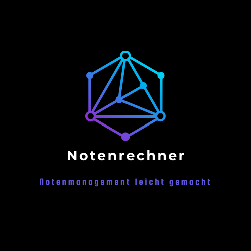

# Notenrechner

This is a  project to track my school grades and courses, for further information check the notes in your corresponding language.

EN

### Notes
- for documentation check /documentation
- the program comments and everything related to development / technical documentation is kept in english, however, the program GUI and user documentation is in german
- this project is still a work in progress
- this repository is meant for development only

### CONTRIBUTING
- At this point in time I do not plan to open this project to the general public and with that to contributions, I might publish this project when it reaches a production-ready state

DE

### Anmerkungen
- Die Benutzeroberfäche und die Nutzerdokumentation ist in Deutsch verfasst, die Kommentare, technische Dokumentation und weitere, nicht für den Endnutzer wichtige Teile sind in englischer Sprache verfasst
- Dieses Projekt befindet sich immer noch in der Aufbau-/ Entwicklungsphase
- Dieses Repository wird nur für die Entwicklung verwendet

### BEITRAGEN
- Aktuell ist nicht vorgesehen, dieses Projekt der Öffentlichkeit zugänglich zu machen. Somit sind aktuell keine Beiträge erwünscht. Das Projekt wird vielleicht veröffentlicht, wenn es ausgereift genug ist.

### REQUIREMENTS
- Python (3.9+)
- package list check requirements.txt
- Oracle database (only tested 21c XE)
